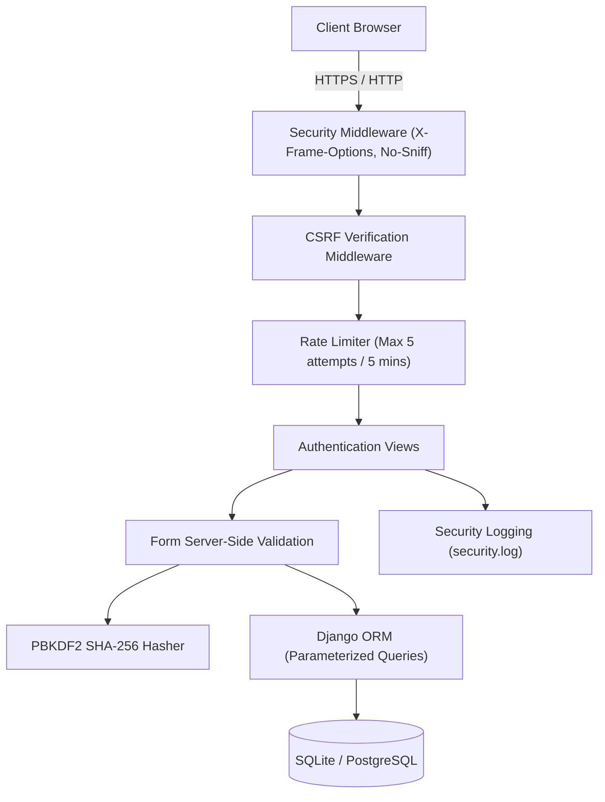

# Secure Web Application Development – Secure User Authentication System

A robust, defense-in-depth web authentication application engineered with **Python 3**, **Django 5.x**, and **Bootstrap 5**. Designed specifically for academic rigor, security evaluations, and college project demonstrations.

---

## 1. Project Overview & Objectives

Traditional web applications often suffer from critical vulnerabilities such as credential theft, session hijacking, SQL injection, Cross-Site Scripting (XSS), and Cross-Site Request Forgery (CSRF). This project implements a comprehensive, defense-in-depth user authentication architecture following OWASP best practices.

### Key Features
- **User Registration**: Real-time server-side validation, password complexity enforcement, duplicate identity checks, and PBKDF2 hashing.
- **Secure Authentication (Login)**: Generic error responses to prevent user enumeration, session fixation protection, and automated brute-force rate-limiting.
- **Session Management**: HttpOnly & SameSite cookie isolation, idle session expiration, and complete server-side session flush upon logout.
- **Authenticated Dashboard & Profile**: Route authorization guards (`@login_required`), safe database operations via Django ORM, and CSRF-protected profile updates.
- **Password Management**: Current-password verification, complexity validation, and session hash refreshment (`update_session_auth_hash`).
- **Security Audit Logging**: Structured logging of authentication successes, failures, and security events without sensitive credential leakage.
- **Automated Security Test Suite**: In-code validation proving mitigation of SQL Injection, XSS, CSRF, and Brute Force attacks.

---

## 2. Technology Stack

- **Backend**: Python 3.11, Django 5.x
- **Frontend**: HTML5, CSS3, Bootstrap 5.3, Bootstrap Icons
- **Database**: SQLite (default zero-config development) / PostgreSQL (configured via `DATABASE_URL`)
- **Testing**: Django Test Framework (`django.test.TestCase`, `Client`)
- **Security Auditing**: Python logging (`security.log`), OWASP ZAP compliant

---

## 3. Project Directory Structure

```
project 1/
│
├── manage.py                     # Django CLI command runner
├── requirements.txt              # Project dependencies
├── .env.example                  # Environment configuration template
├── .env                          # Local secrets (excluded from version control)
├── .gitignore                    # Git rules ignoring .env, db, cache, logs
│
├── secure_auth/                  # Django project root package
│   ├── __init__.py
│   ├── settings.py               # Security headers, cookies & app settings
│   ├── urls.py                   # Master URL routing & custom error handlers
│   ├── asgi.py                   # ASGI config
│   └── wsgi.py                   # WSGI config
│
├── accounts/                     # Authentication & security app
│   ├── migrations/               # Database schema migration files
│   ├── __init__.py
│   ├── admin.py                  # Read-only audit log inspection
│   ├── apps.py                   # App configuration
│   ├── error_handlers.py         # Leak-free 400/403/404/500 handlers
│   ├── forms.py                  # Server-side validation forms
│   ├── models.py                 # UserProfile and LoginAttempt models
│   ├── security.py               # Rate limiting & security logging logic
│   ├── tests.py                  # 19 automated functional and security tests
│   ├── urls.py                   # Accounts routing
│   └── views.py                  # Secure controller actions
│
├── templates/                    # HTML5 presentation templates
│   ├── base.html                 # Master layout (Bootstrap 5 CDN + Nav)
│   ├── home.html                 # Landing page & security controls matrix
│   ├── signup.html               # Registration with password complexity
│   ├── login.html                # Login with brute-force defense
│   ├── dashboard.html            # Protected user dashboard
│   ├── profile.html              # Profile viewer & editor
│   ├── change_password.html      # Secure password change
│   └── error.html                # Generic error template
│
└── static/                       # Client-side styling and scripts
    ├── css/
    │   └── style.css             # Security badges, card styles
    └── js/
        └── script.js             # Notification timers & UI helpers
```

---

## 4. Quick Start Guide

### Step 1: Clone or Navigate to Directory
```powershell
cd "c:\Users\neshh\OneDrive\Desktop\project 1"
```

### Step 2: Install Dependencies
```powershell
pip install -r requirements.txt
```

### Step 3: Configure Environment
Copy `.env.example` to `.env` (already created for you):
```powershell
copy .env.example .env
```

### Step 4: Apply Database Migrations
```powershell
python manage.py migrate
```

### Step 5: (Optional) Create an Admin Superuser
```powershell
python manage.py createsuperuser
```

### Step 6: Start the Development Server
```powershell
python manage.py runserver
```
Navigate to **`http://127.0.0.1:8000/`** in your web browser.

---

## 5. Security Architecture & Controls



### Defense Mechanisms Detail
1. **SQL Injection Defense**: Django ORM utilizes SQL query parameterization by default. User input is never concatenated directly into SQL statements.
2. **Cross-Site Scripting (XSS) Defense**: Django templates automatically escape all HTML context variables (`<` becomes `&lt;`). Direct use of `|safe` is prohibited on untrusted input.
3. **Cross-Site Request Forgery (CSRF) Defense**: State-changing POST forms mandate the `` synchronizer token. Missing or mismatched tokens yield an immediate HTTP 403 Forbidden.
4. **Brute Force & Rate Limiting**: `LoginAttempt` logs monitor failed attempts per IP and username. Exceeding 5 failures within 5 minutes results in a temporary cooldown lockout.
5. **Session Fixation Defense**: `request.session.cycle_key()` is triggered on successful login to invalidate the pre-authentication session token.
6. **Information Disclosure Prevention**: Generic authentication errors (`"Invalid username or password."`) prevent account enumeration. Custom 400, 403, 404, and 500 error pages suppress internal stack traces.

---

## 6. Running Automated Tests

Execute the comprehensive automated test suite (19 test cases):
```powershell
python manage.py test accounts -v 2
```

### Security Test Matrix

| Security Test | Attack / Input | Expected Result | Status |
| :--- | :--- | :--- | :--- |
| **SQL Injection** | `' OR '1'='1` | Query parameter neutralized, login rejected | **PASS** |
| **Cross-Site Scripting (XSS)** | `<script>alert("XSS")</script>` | Sanitized to `&lt;script&gt;...` | **PASS** |
| **CSRF Protection** | Missing CSRF token on POST | Request rejected with HTTP 403 | **PASS** |
| **Unauthorized Access** | Direct GET to `/dashboard/` | Redirects to `/login/?next=/dashboard/` | **PASS** |
| **Weak Password** | `123456` | Form rejected with complexity warnings | **PASS** |
| **Wrong Password** | `WrongPassword999` | Rejected with generic error message | **PASS** |
| **Brute Force Mitigation** | 5 consecutive failed logins | 6th attempt locked with cooldown notice | **PASS** |
| **Session Invalidation** | Access dashboard after logout | Redirects to login, session destroyed | **PASS** |
| **Password Hashing** | Raw database inspection | Stored as `pbkdf2_sha256$...` | **PASS** |
